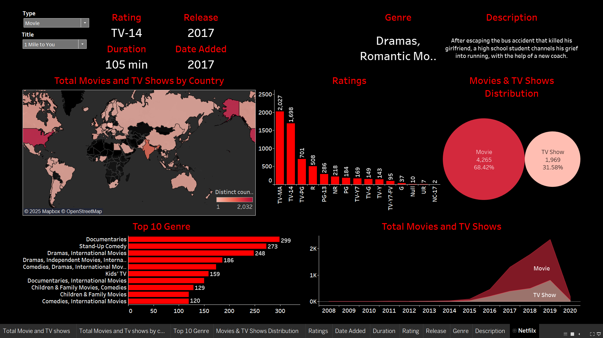
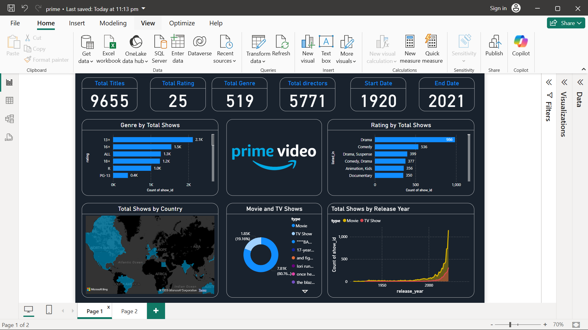

# Netflix & Amazon Prime Dashboard 📊

## Overview  
This repository contains data visualization dashboards for Netflix and Amazon Prime, created using **Tableau** and **Power BI**. The project aims to analyze streaming content, providing insights into various metrics like genres, ratings, release years, and more.

## Netflix Dashboard (Tableau)  
  

## Amazon Prime Dashboard (Power BI)  
  

## Repository Structure  
📂 **Netflix Dashboard (Tableau)**  
- `Netflix.twb` → Tableau Workbook for Netflix Data  
- `netflix_titles.csv` → Netflix dataset used for visualization  
- `netflix_dashboard.png` → Screenshot of the Netflix dashboard  

📂 **Amazon Prime Dashboard (Power BI)**  
- `prime.pbix` → Power BI Report for Amazon Prime Data  
- `amazon_prime_titles.csv` → Amazon Prime dataset  
- `prime_1.png` → Screenshot of the Amazon Prime dashboard  

## Data Sources  
- **Netflix Data**: [Kaggle Netflix Dataset](https://www.kaggle.com/datasets/shivamb/netflix-shows)  
- **Amazon Prime Data**: [Kaggle Amazon Prime Dataset](https://www.kaggle.com/datasets/smeitoma/amazon-prime-movies-and-tv-shows)  

## Tools Used  
- **Tableau** 🟣  
- **Power BI** 🟡  
- **CSV Data Processing**  

## How to Use  
1. Open `Netflix.twb` in Tableau to explore the Netflix dashboard.  
2. Open `prime.pbix` in Power BI to analyze Amazon Prime data.  
3. Refer to the `.png` files for a preview of the visualizations.  

## Contribution  
Feel free to fork the repo, suggest improvements, or use the datasets for further analysis! 🚀  

---

Happy Visualizing! 📈  
